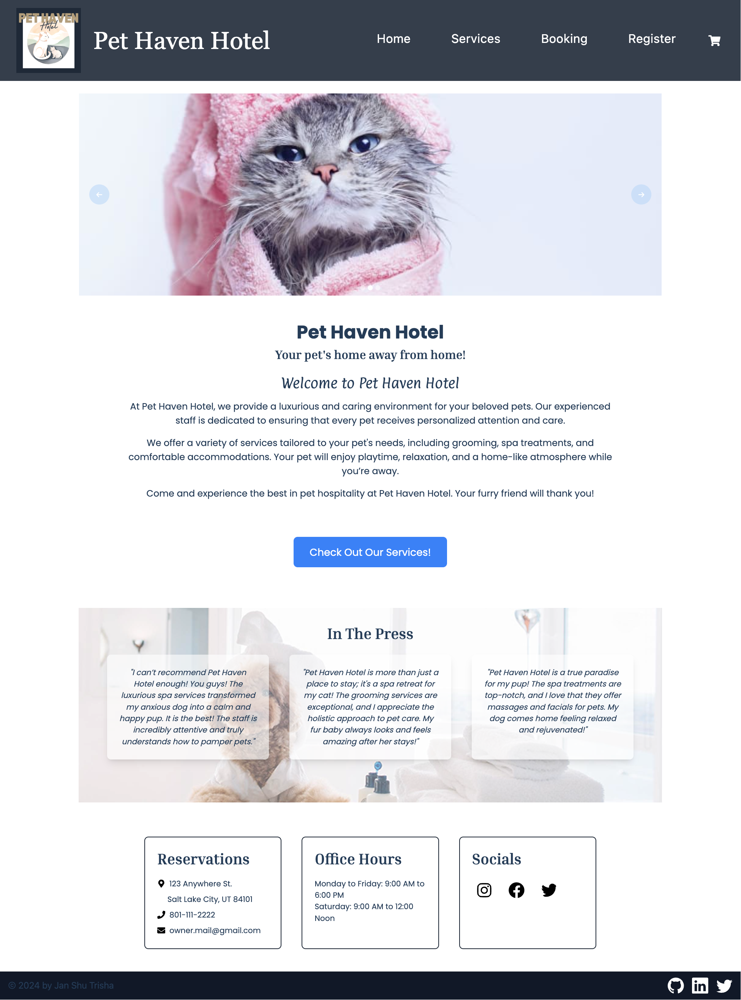

# 🐱🏩🐶  Pet Haven Hotel

[](https://github.com/UBC-Yang)
[](https://github.com/Thecaprifire)
[](https://github.com/trishamasbate)<br>
[](https://choosealicense.com/licenses/mit/)


## 📃 Description
**Pet Haven Hotel** is a single-page application built with the MERN stack designed to manage a pet hotel for cats and dogs. The platform allows pet owners to book accommodations for their pets, view details about available services, and manage their bookings. The application features user authentication, booking management, and interactive elements to enhance user experience. It also supports responsive design, ensuring a seamless experience on both desktop and mobile devices.

## 📌 Table of Contents
- [🐱🏩🐶  Pet Haven Hotel](#--pet-haven-hotel)
  - [📃 Description](#-description)
  - [📌 Table of Contents](#-table-of-contents)
  - [🔎 User Story](#-user-story)
  - [✅ Acceptance Criteria](#-acceptance-criteria)
  - [💡 Usage and Installation Instructions](#-usage-and-installation-instructions)
  - [🎞️ Application Previews](#️-application-previews)
  - [🗝️ Resources](#️-resources)
  - [❓ Questions](#-questions)
  - [🪪 License](#-license)

## 🔎 User Story
```md
AS A pet owner
I WANT to book accommodations for my pet at Pet Haven Hotel
SO THAT my pet can have a comfortable stay while I am away
```

## ✅ Acceptance Criteria
```md
GIVEN the Pet Haven Hotel application

WHEN I load the application
THEN I am presented with a homepage featuring information and a navigation bar with options to view Home, Services, and Register

WHEN I click on the Services option
THEN I am presented with a list of available services for dogs and cats, including descriptions and prices

WHEN I click on the Book Now option without being logged in
THEN I am prompted to log in or sign up with a modal displaying two input fields for email and password, and a toggle to switch between Login and Signup

WHEN I toggle to Signup
THEN I am presented with inputs for a name, username, an email address, and a password

WHEN I continue with Signup
THEN I am inquired to provide inputs for my pet's name, gender, age, breed, and a section for additional notes

WHEN I toggle to Login
THEN I am presented with two inputs for an email address and a password and a Login button

WHEN I enter valid credentials and click on the Login or Signup button
THEN my account is authenticated, I am logged in, and the modal closes

WHEN I am logged in
THEN the navigation bar updates to show options to view Home, Services, Profile, and Logout

WHEN I click on the Services option after logging in
THEN I am presented with a list to choose services, select dates and times, and enter special instructions

WHEN I fill out the booking form and submit it
THEN my booking is confirmed, and those details are added to my cart

WHEN I click on the Profile option
THEN I am presented with a list of my current and past bookings, each displaying the pet's name, services selected, booking dates, and a Cancel button for future bookings

WHEN I click on the Cancel button for a future booking
THEN I am prompted to confirm the cancellation, and upon confirmation, the booking is canceled and removed from my list

WHEN I click on the Logout button
THEN I am logged out of my account and the navigation bar reverts to displaying the options to view Home, Services and Register
```

## 💡 Usage and Installation Instructions
✨ **Using Render:**

[Pet Haven Hotel Website](https://pet-haven-3.onrender.com/)

✨ **Using the GitHub Repository:**

1.  Clone the repository:
```
https://github.com/UBC-Yang/Pet-Haven-Hotel
```
1.  Provide your MongoDB Atlas database credentials in a `.env` file. Make sure to supply your `username`, `password`, and `database name`. Follow this format:
```
MONGODB_URI=mongodb+srv://<username>:<password>@cluster0.44mlj.mongodb.net/<databasename>?retryWrites=true&w=majority&appName=Cluster0
```
3.	Launch an integrated terminal directly from your editor.
4.  Install the necessary packages to initialize the application. You can also execute the command `npm install`.
5.  Run the `npm run seed` command to initialize the production.  
6.	Execute `npm run develop` to deploy the application in development.
7.  Test the functionality of the application by using Render.


## 🎞️ Application Previews

**The Pet Haven Hotel Website**


## 🗝️ Resources
- Dynamic JavaScript
- License Badge: [Shields.io](https://shields.io/)
- [Starter Code](https://github.com/coding-boot-camp/solid-broccoli)
- [Nodemon](https://www.npmjs.com/package/nodemon)
- [Dotenv](https://www.npmjs.com/package/dotenv)
- [Bycrypt](https://www.npmjs.com/package/bcrypt)
- [ESLint](https://www.npmjs.com/package/eslint)
- [React](https://www.npmjs.com/package/react)
- [Vite](https://www.npmjs.com/package/vite)
- [Concurrently](https://www.npmjs.com/package/concurrently)
- [Apollo Client](https://www.npmjs.com/package/@apollo/client)
- [Express](https://www.npmjs.com/package/express)
- [Jsonwebtoken](https://www.npmjs.com/package/jsonwebtoken)
- [Mongoose](https://www.npmjs.com/package/mongoose)
- [JWT-Decode](https://www.npmjs.com/package/jwt-decode)
- [GraphQL](https://www.npmjs.com/package/graphql)
- [Bootstrap](https://www.npmjs.com/package/bootstrap)
- [Tailwind](https://www.npmjs.com/package/tailwindcss)
- [Visual Studio Code](https://code.visualstudio.com/)


## ❓ Questions
Contact the authors with any questions!<br>

✨ Github link: [UBC-Yang](https://github.com/UBC-Yang)<br>
Email: yang.shu.psy@gmail.com<br>

✨ Github link: [Thecaprifire](https://github.com/Thecaprifire)<br>
Email: ianjandaluz@gmail.com<br>

✨ Github link: [trishamasbate](https://github.com/trishamasbate)<br>
Email: trisha.masbate@gmail.com<br>

## 🪪 License
This project is [MIT](https://choosealicense.com/licenses/mit/) licensed.<br />

Copyright © 2024
  
<hr>
<p align='center'><i>
Enjoy your Literary Journey! 📖
</i></p>